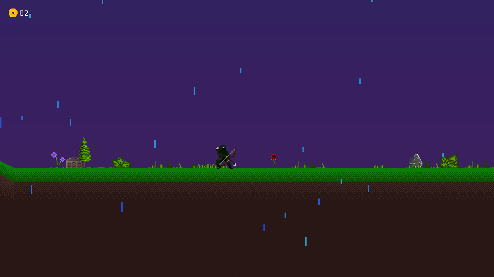
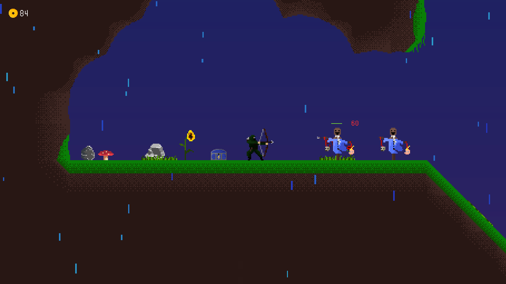
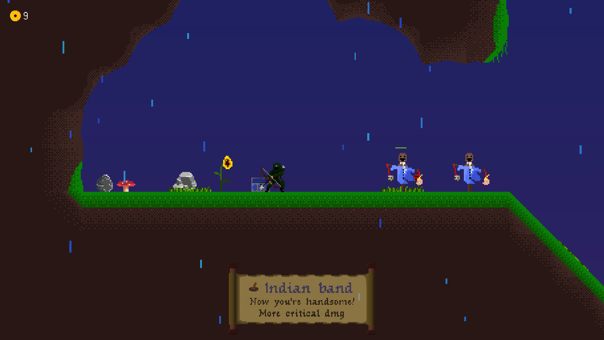

# Architect's Dream

> A 2D roguelite game with a dose of humor :grin:

## Table of contents

- [Architect's Dream](#architects-dream)
  - [Table of contents](#table-of-contents)
  - [General info](#general-info)
  - [Technologies](#technologies)
  - [Setup](#setup)
  - [Features](#features)
  - [Youtube video](#youtube-video)
  - [Screenshots](#screenshots)
  - [Status](#status)
  - [Why did I create it](#why-did-i-create-it)
  - [Contact](#contact)

## General info

Your goal is to survive as long as you can in this 'dark' world.

Fight enemies. Find gate. Choose your destination. Don't die.

Remember: items make you stronger

## Technologies

* Engine: Unity 3D
* Sprites: Aseprite
* Music: BoscaCeoil

## Setup

TBD

## Features

The project is in pre-pre-alpha I would say so do not expect great gameplay :sweat_smile:

Implemented:

* 10+ items
* 1 pseudorandom maps
* 1 stationary practice enemy
* Movement and shooting
* Damage indicators
* Different chest with various content

In plans:

* 16 different maps
* A gate to moving between stages
* Enemies
* More items
* Correct sprites
* Hero life system
* Skills
* List of picked items

## Youtube video

[Playlisy about it!](https://www.youtube.com/watch?v=FwzFYSictSQ&list=PL38UXmZq3xXmpF_ji6-UATfILLv2F2PDx)

## Screenshots

## Status

Project is _work in progress_.

That means it is _NOT_ finished and I am working on it.

I am open to any suggestions about it so if you want you can create an issue to it or contact me :)

## Why did I create it

I love play games and I always wanted to create one (or more). My first idea was to make a rpg game but it didn't go well. At the same time I started to play [Risk of Rain 2](https://www.riskofrain.com/). I suspended old project and started new one similar to Risk of Rain (first part) and here it is Architect's Dream!

## Contact

You can find contact information [here](https://jacek-jendrzejewski.azurewebsites.net/Contact).
